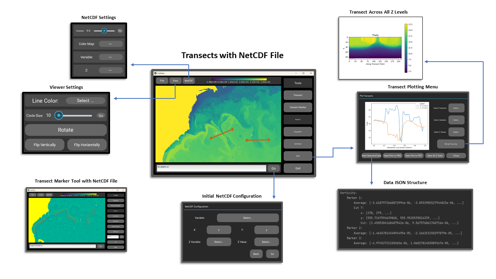

# CutView
CutView is a GUI for getting pixel data from images and data values from NetCDF files along a linear transects. This simplifies the analysis of satellite imagery or other images with linear features where the brightness of the pixel can be used to gauge some physical value. Examples include measuring sea ice floe concentration or characterizing ice sheet fractures. For NetCDF files, CutView serves as an easy way to view datasets quickly along any dimensions and extract data along transects. CutView is designed to make the measurement of linear features as automatic as possible through “marker” tools where linear features can be marked out and have transects automatically be made across. Multiple features can be marked at once on a file and saved all together as a “project” that can be reuploaded and continued or edited.

Users can display a plot of the data as well as package the data into a downloadable JSON file. When extracting values from the image/dataset, the program uses linear interpolation to interpolate between the values of the pixels to ensure the most accurate portrayal of the line drawn. 

Please refer to the repo wiki for installation and usage instructions.
