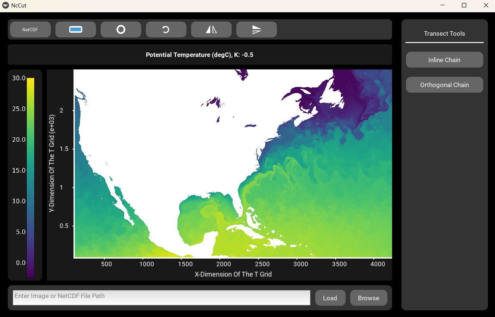

# NcCut

### Documentation: [NcCut Docs](https://nccut.readthedocs.io/en/latest/index.html)

NcCut is a GUI for getting pixel data from images and data values from NetCDF files along linear transects. This simplifies the analysis of images with linear features where the brightness of the pixel can be used to gauge some physical value. Some examples include measuring sea ice floe concentration or characterizing ice sheet fractures from satellite imagery. For NetCDF files, NcCut serves as an easy way to view datasets quickly along any set of dimensions and to extract data along transects. Using NcCut users can view vertical cross-sections of their data over all values of a third dimension along the transect drawn. In addition, NcCut is designed to make the measurement of linear features as automatic as possible through it's "Transect Marker" tool where linear features can be marked out and have transects automatically be made perpendicular to the feature. Multiple features can be marked at once on a file and saved all together as a “project” that can be uploaded and continued or edited.




Users can display a plot of the data as well as package the data into a downloadable JSON file. When extracting values from the image/dataset, the program uses linear interpolation to interpolate between the values of the pixels to ensure an accurate portrayal of the line drawn. 

This is an open source project. For contribution guidelines please refer to the contribution section of the [docs](https://nccut.readthedocs.io/en/latest/contribution.html).

# <ins>Installation</ins>

1. It is recommended to first create a virtual environment before installing packages on your system to prevent package compatibility issues. From the terminal at your desired directory use:

   * For Linux and Mac:
    ```
    python3 -m venv nccut-venv
    source nccut-venv/bin/activate
    ```

   * For Windows:
    ```
    python -m venv nccut-venv
    nccut-venv\Scripts\activate
    ```

2. Then install NcCut using PIP:

```
pip install nccut
```
3. To run the app execute the following Python code:
```
from nccut.nccut import NcCut
NcCut().run()
```
4. Or to execute from the command line:
```
nccut
```

  * You can optionally pass in a file to be loaded as well:
   ```
   nccut -file file_name
   ```

5. To exit virtual environment when finished:
 
```
deactivate
```

6. To open the same virtual environment again in the future simply execute:

   * For Linux and Mac:
    ```
    source nccut-venv/bin/activate
    ```

   * For Windows:
    ```
    nccut-venv\Scripts\activate
    ```

If you are having trouble installing NcCut please refer to the Troubleshooting section of the [docs](https://nccut.readthedocs.io/en/latest/installation.html)

# <ins>Using the App</ins>

* If you would like to try out the app there are example image and NetCDF files here: [https://zenodo.org/records/13883476](https://zenodo.org/records/13883476)

## Running the App

1. To install the app, refer to installation instructions for your OS
2. Execute the following python code:
```
from nccut.nccut import NcCut
NcCut().run()
```

## Loading a File

1.  To load an image file or NetCDF file either select "Browse" to locate the file or you can type the relative or absolute file path to the file into the file entry text box and select "Load".
    * If you are loading a NetCDF file a popup window will appear with additional selections:
        * Select which variable from your file you would like to see.
        * Confirm or adjust which dimensions you would like to use as the X and Y axes for your variable.
        * If your variable has data in a third dimension select the Z dimension and an initial Z value to display. You will be able to toggle between z values later.
        * Select "Load" to load the selected data


2. You can scroll to zoom in and out of the image and can click and drag the image to move it around.
3. From the settings bar you can rotate or flip the image as well as change graphic settings for the tools.
4. If you are loading a NetCDF file, from the "NetCDF" menu in the settings bar you can change which variable or z value you'd like to see as well as change the color map or contrast of the image.
   * Changing the contrast and colormap only affects the displayed image. Transect data is taken from the NetCDF file itself.

## Tools
* NcCut has two types of tools for making transects.
### Transect Chain
* Using this tool chains of transects can be drawn. Transects will be taken along the line segments drawn between the clicked points. Multiple such "Chains" can be drawn out at once before being plotted.


1. Hit "Transect Chain" to enter transect mode
2. Click points along the feature you'd like to make transects along. Transects will be made between the points you click.
    * Select "Drag Mode" from the actions sidebar to drag the image without selecting points, and select "Transect Mode" to go back. 
    * Select "Edit Mode" to delete either the last point clicked or the last chain drawn. You can also press the esc key to delete the last chain drawn.
3. Right click to select the final point or select "New Chain" to begin a new chain and repeat for as many chains as you'd like.
4. When done select the "Plot" button and a popup will appear with a plot of all transects from the first chain and downloading options.


### Transect Marker
* Using this tool multiple "Markers" can be drawn onto a loaded file. These "Markers" can all be saved together as a project and reloaded into the viewer later. When a large file is being explored this allows you to mark out features over multiple sessions.


1. Hit the "Transect Marker" button to enter transect mode
2. Click points along the feature you'd like transects of. Dots will appear on either side of the line drawn indicating the start and end of the transects that will be made
   * Select "Drag Mode" from the actions sidebar to drag the image without selecting points, and select "Transect Mode" to go back.
   * Select "Edit Mode" to delete either the last point clicked or the last marker drawn. You can also press the esc key to delete the last marker drawn.
   * To change the width of the transects being made you may enter the number of pixels into the "Width" text box. Select "Set" to change the width for all future transects.
3. Right click to select the final point or select "New Marker" to begin a new marker and repeat for as many markers as you'd like
4. When done select the "Plot" button and a popup will appear with a plot of all transects from the first marker and downloading options.
   * If you want to continue working on your project at a later time, select all the transects and save the data to JSON format. Refer to section below for reloading that data.


#### Uploading a project
1. Load the same dataset/image you worked on previously.
2. Hit the "Transect Marker" button to enter transect mode.
3. Instead of clicking new points, select the "Upload Project" button.
4. Enter the file name of the transect data you saved previously and select "Ok".
5. All markers from the file will load onto the viewer and you can continue working on the project.

For more on these tools please refer to [usage section](https://nccut.readthedocs.io/en/latest/usage.html) of the docs.