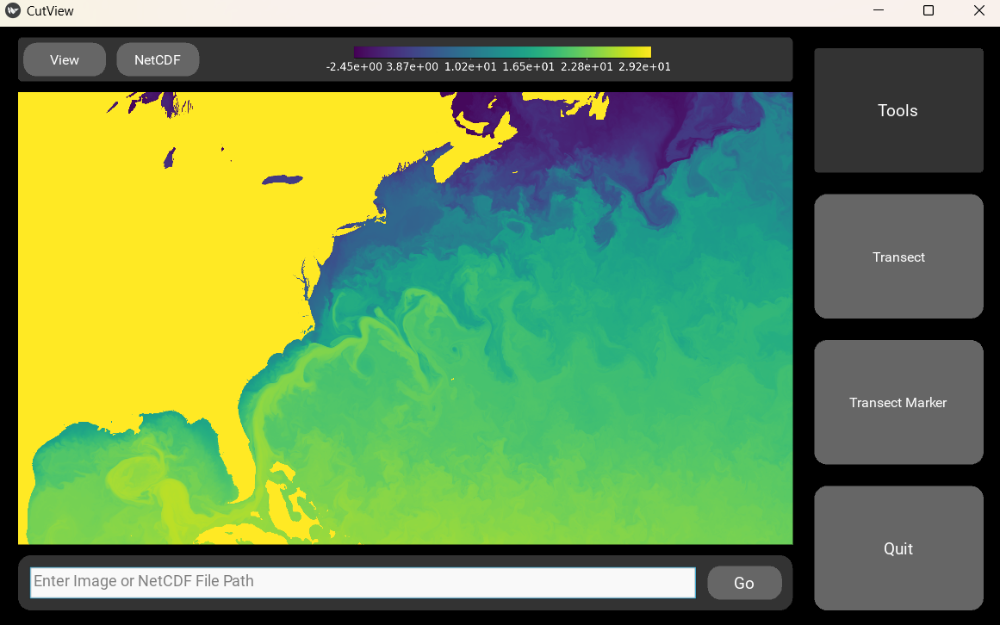

# CutView
CutView is a GUI for getting pixel data from images and data values from NetCDF files along a linear transects. This simplifies the analysis of satellite imagery or other images with linear features where the brightness of the pixel can be used to gauge some physical value. Examples include measuring sea ice floe concentration or characterizing ice sheet fractures. For NetCDF files, CutView serves as an easy way to view datasets quickly along any dimensions and extract data along transects. CutView is designed to make the measurement of linear features as automatic as possible through “marker” tools where linear features can be marked out and have transects automatically be made across. Multiple features can be marked at once on a file and saved all together as a “project” that can be reuploaded and continued or edited.




Users can display a plot of the data as well as package the data into a downloadable JSON file. When extracting values from the image/dataset, the program uses linear interpolation to interpolate between the values of the pixels to ensure the most accurate portrayal of the line drawn. 

Please refer to the [docs](https://cutview.readthedocs.io/en/latest/index.html) for installation and usage instructions. This is an open source project. For contribution guidelines please refer to the contribution section of the [docs](https://cutview.readthedocs.io/en/latest/contribution.html).

# Installation Instructions

## Linux and Mac

1. It is recommended to first create a virtual environment (if your IDE does not do it for you) before installing packages on your system to prevent package compatibility issues. From the terminal at your desired directory use:
```
python3 -m venv venv
source venv/bin/activate
```
2. Then install CutView using PIP:

```
pip install cutview
```
3. To run the app execute the following Python code:
```
from cutview.cutview import CutView
CutView().run()
```
4. To exit virtual environment when finished:
 
```
deactivate
```

5. To open the same virtual environment again in the future simply execute:

```
source venv/bin/activate
```

## Windows

1. It is recommended to first create a virtual environment (if your IDE does not do it for you) before installing packages on your system to prevent package compatibility issues. From the terminal at your desired directory use:
```
python3 -m venv venv
venv\Scripts\activate
```
2. Then install CutView using PIP:

```
pip install cutview
```
3. To run the app execute the following Python code:
```
from cutview.cutview import CutView
CutView().run()
```
4. To exit virtual environment when finished:
 
```
deactivate
```

5. To open the same virtual environment again in the future simply execute:

```
venv\Scripts\activate
```

If you are having trouble installing CutView please refer to the Troubleshooting section of the [docs](https://cutview.readthedocs.io/en/latest/installation.html)

# Usage Instructions

* If you would like to try out the app there are example image and NetCDF files in the [support](https://github.com/rchartra/CutView/tree/master/support) folder of this repository
    * Relative file paths:

        `support/example.jpg`\
        `support/test_img.png`\
        `support/example_4v.nc `\
        `support/example_3d.nc`\
    * There is an example project file for upload as well:

        `support/example_markers.json`


## Running app

1. To install the app, refer to installation instructions for your OS
2. Execute the following python code:
```
from cutview.cutview import CutView
CutView().run()
```

## Loading a file

1.  To load image file or NetCDF file type the relative or absolute file path into file entry text path and select "Go"
    * If you are loading a NetCDF file a popup window will appear with additional selections:
        * Select which variable from your file you would like to see.
        * Confirm or select which dimensions you would like to use as the X and Y axes for your variable.
        * If your variable has data in a third dimension select the Z dimension and an initial Z value to display. You will be able to toggle between z values later.
        * Select "Go" to load the selected data


2. You can scroll to zoom in and out of the image and can click and drag the image to move it around.
3. From the "View" menu in the settings bar you can rotate or flip the image as well as change graphic settings for the tools.
4. If you are loading a NetCDF file, from the "NetCDF" menu in the settings bar you can change which variable or z value you'd like to see as well as change the color map or contrast of the image.

## Tools
* To clear widgets from the viewer at any point click any of the tool buttons
### Transects
* This tool will make multiple transects between two points

1. Hit "Transect" to enter transect mode
2. Click two points you'd like to make a transect between
    * Select "Drag Mode" from the actions sidebar to drag the image without selecting points, and select "Transect Mode" to go back.
    * Select "Edit Mode" to delete either the last point clicked or the last transect drawn.
3. Repeat for as many transects as you'd like
4. When done select the "Plot" button and a popup will appear with a plot of all transects and downloading options. 
    * You can select which transects you'd like to plot
    * If using a NetCDF file you can select multiple variables and Z values you'd like to see your selected transects plotted from.
    * If using a NetCDF file with a Z dimension you can plot an image of a single transect taken over all Z values of your dataset. To use this option only one transect can be selected.
5. You can save the current plot to .PNG or .PDF formats. You can also save the **currently selected** data or the currently selected data over all Z variables to a JSON file (see "Data Output" section of the [docs](https://cutview.readthedocs.io/en/latest/data_output.html) for more on how data is formatted).
6. Click anywhere around the popup or the close button to dismiss plotting window.

### Marker
* This tool allows you to click along a feature and have transects automatically made perpendicular to the feature. 
* You can mark out multiple features and save them all together as a single "project". 
* You can upload previous projects to edit or continue them.

#### Working on a project

1. Hit the "Transect Marker" button to enter transect mode
2. Click points along the feature you'd like transects of. Dots will appear on either side of the line drawn indicating the start and end of the transects that will be made
    * Select "Drag Mode" from the actions sidebar to drag the image without selecting points, and select "Transect Mode" to go back.
    * Select "Edit Mode" to delete either the last point clicked or the last marker drawn.
    * To change the width of the transects being made you may enter the number of pixels into the "Width" text box. Select "Go" to change the width for all future transects.
        * This will not change the width of transects already drawn
        * The default width is 40 pixels, you can enter any width within 0 and 400
        * If you change the width of a marker any new markers will continue to use that same width unless you change it again.
3. Select "New Line" to begin a new marker and repeat for as many markers as you'd like
4. When done select the "Plot" button and a popup will appear with a plot of all transects from the first marker and downloading options. 
    * You can select which transects from which markers you'd like to plot
    * If using a NetCDF file you can select which variables and Z values you'd like to see your selected transects plotted from.
    * If using a NetCDF file with a Z dimension you can plot an image of a single transect taken over all Z values of your dataset.
5. You can save the current plot to .PNG or .PDF formats. You can also save the currently selected data or the currently selected data over all Z variables to a JSON file (see "Data Output" section of the [docs](https://cutview.readthedocs.io/en/latest/data_output.html) for more on how data is formatted).
    * If you want to continue working on your project at a later time, select all the transects and save the data to JSON format. Refer to section below for reloading that data.
6. Click anywhere around the popup or the close button to dismiss

#### Uploading a project
1. Load the same dataset/image you worked on previously.
2. Hit the "Transect Marker" button to enter transect mode.
3. Instead of clicking new points, select the "Upload Project" button.
4. Enter the file name of the transect data you saved previously and select "Ok".
5. All markers from the file will load onto the viewer and you can continue working on the project.
