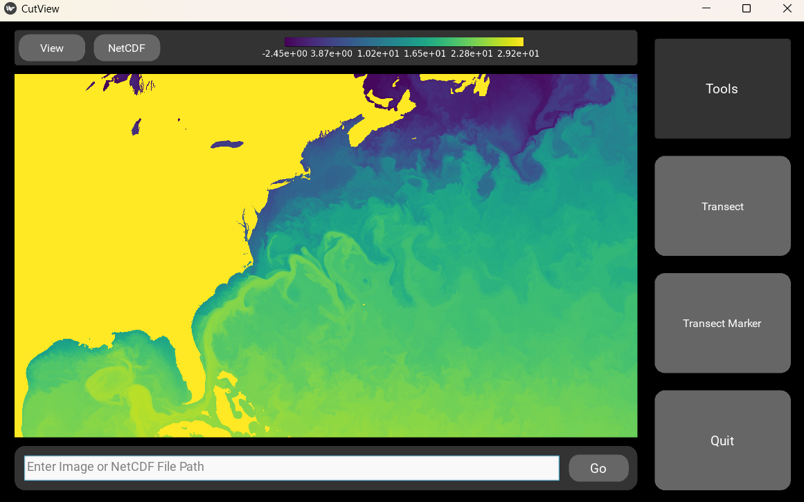

.. CutView documentation master file, created by
   sphinx-quickstart on Thu Jun 27 12:25:15 2024.
   You can adapt this file completely to your liking, but it should at least
   contain the root `toctree` directive.

Welcome to CutView's documentation!
===================================

**CutView** is a GUI for getting pixel data from images and data values from NetCDF files along a linear transects. This simplifies the analysis of satellite imagery or other images with linear features where the brightness of the pixel can be used to gauge some physical value. Examples include measuring sea ice floe concentration or characterizing ice sheet fractures. For NetCDF files, CutView serves as an easy way to view datasets quickly along any dimensions and extract data along transects. CutView is designed to make the measurement of linear features as automatic as possible through “marker” tools where linear features can be marked out and have transects automatically be made across. Multiple features can be marked at once on a file and saved all together as a “project” that can be uploaded and continued or edited.

Here you will find installation and usage instructions, trouble shooting tips, example tutorials, and code documentation for contributors.

.. toctree::
   :maxdepth: 2
   :caption: Contents:

   installation
   usage
   example
   data_output
   contribution
