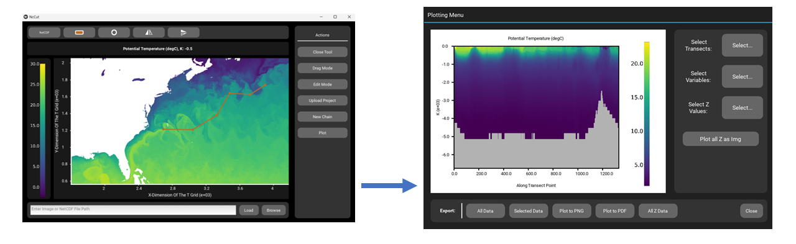

.. NcCut documentation master file, created by
   sphinx-quickstart on Thu Jun 27 12:25:15 2024.
   You can adapt this file completely to your liking, but it should at least
   contain the root `toctree` directive.

Welcome to NcCut's documentation!
===================================

**NcCut** is a GUI for getting pixel data from images and data values from NetCDF files along linear transects. This simplifies the analysis of images with linear features where the brightness of the pixel can be used to gauge some physical value. Some examples include measuring sea ice floe concentration or characterizing ice sheet fractures from satellite imagery. For NetCDF files, **NcCut** serves as an easy way to view datasets quickly along any set of dimensions and to extract data along transects. Using **NcCut** users can view vertical transect images of their data along a third dimension and the marked out line. In addition, **NcCut** is designed to make the measurement of linear features as automatic as possible through it's *Transect Marker* tool where linear features can be marked out and have transects automatically be made perpendicular to the feature. Multiple features can be marked at once on a file and saved all together as a “project” that can be uploaded and continued or edited.

Here you will find installation and usage instructions, trouble shooting tips, example tutorials, and code documentation for contributors.

.. toctree::
   :maxdepth: 2
   :caption: Contents:

   installation
   usage
   example
   data_output
   contribution
