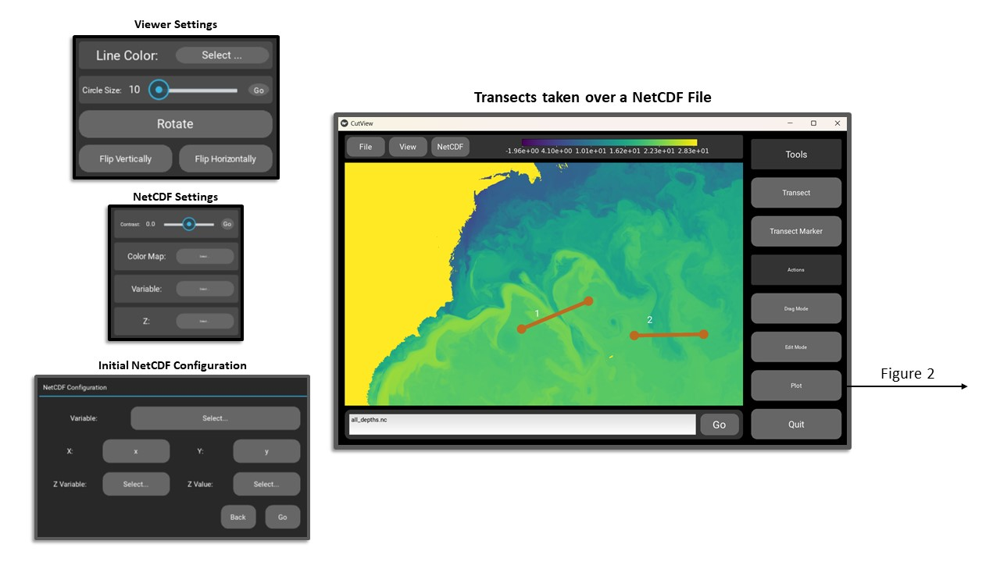
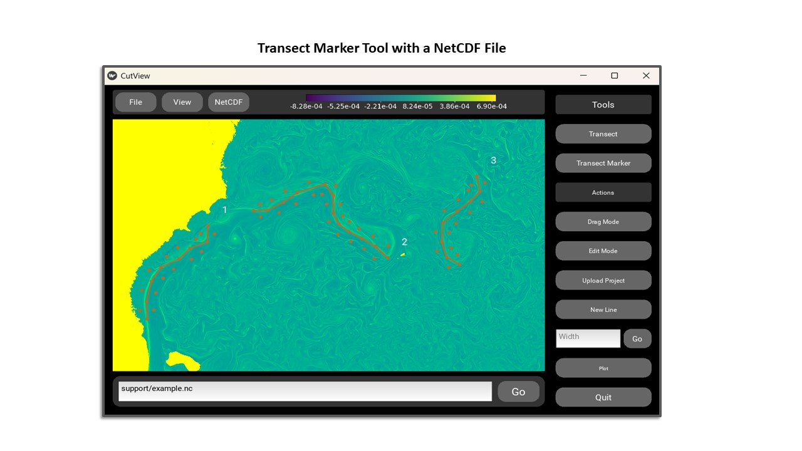

# Statement of Need

CutView is a simple yet flexible NetCDF4 file and image viewer that is designed to require no programming or GIS 
experience to use.  In addition to being a GUI for generating "quick" visualizations of NetCDF4 data, CutView 
additionally allows a user to view and produce plots of transets of NetCDF4 data along various dimensions.  This is a 
commonly performed task in oceanography and atmospheric sciences research used to understand the vertical composition of 
a section of ocean or atmosphere. For example, @Sivkov:2021 used such vertical transects to study the vertical 
distributions of suspended particulate matter across the Atlantic ocean. In another example, @Gutjahr:2022 used vertical 
transects of modeled climate and ocean data in Greenland to study air-sea interactions during a Katabatic storm.

Such transect selecting tools are a feature common in GIS software (@qgis, @transectizer, @GRASS_GIS) and are present in 
some more complex viewers that work with unstructured data [@odv], but these options are all either meant for more 
complicated data formats or require a user to spend a great amount of time learning how to use the software before they 
can do any meaningful data analysis. CutView provides this transecting functionality with a GUI interface, allowing for 
rapid selection of transects, which is often very useful in initial investigation or feature selection applications. 
There are many simple NetCDF viewers that already serve this audience (@Ncview, @Panoply, @ncvue), but none of these 
simpler viewers allow users to take transects across NetCDF data.

# Functionality

As per the name, CutView’s functions can be divided into two main categories:

## View

CutView allows users to load NetCDF4 files, or images in .JPG, .JPEG, or .PNG formats, and has adjustable graphics for 
different file sizes. In the case of NetCDF4 files, the user can choose between different variables and dimensions of 
the data to view. The user can select which dimensions to use as the x, y and z dimensions for the viewer, and once 
displayed the user can switch between different displays of the x, y dimensions at different z values. This is intuitive 
for many NetCDF4 files which contain three-dimensional datasets with data arrays at different vertical heights or 
depths. The data is displayed as an image mapped to a color map, which can be changed by the user as well as the 
contrast of the image. Once loaded and configured users can drag, rotate, flip, and zoom in on the file however they 
please. The NetCDF4 viewing capabilities are shown in Figure 1, which is an example using the MIT General Circulation 
Model LLC4320 simulation dataset (accessed via \verb|xmitgcm| https://xmitgcm.readthedocs.io/en/latest/index.html). 

## Cut

Using CutView users can mark out and plot transects onto loaded images or NetCDF4 data using two tools:

The first is the simple transect tool, where users can click on two endpoints and a line will be drawn between them. If 
the loaded file is an image, the mean of the RGB values of each pixel along that line will be selected. The pixels are 
interpolated using linear interpolation to improve the accuracy of the pixel selection. If the loaded file is a NetCDF4 
file, the data values from the original dataset (also interpolated) are selected along that line. Multiple such 
transects can be drawn and plotted all together in the plotting menu (Figure 2). The second is the transect marker tool. 
Using this tool users click points along a feature and transects of a set width will be made orthogonal to the line 
marked out by the user (Figure 3). This width can be adjusted at any point in the marking process and multiple markers 
can be drawn on the same file and plotted together. For use on large projects worked on over multiple sessions, the 
marker data saved from the plotting menu can be reloaded back into CutView and continued.

In the plotting menu (Figure 3) users can select which transects/markers to plot, and if the file is a NetCDF file the 
user can additionally plot multiple variables and values along the chosen z dimension. Additionally, users can see a 
plot of the data values for all z values shown as an image, which can be done for multiple variables at once. From here 
users can choose to save the data to a .JSON file as well as save the plot to either a .PNG or .PDF format. The JSON 
file groups the pixel data and their coordinates together and labels them by the transect number shown on the viewer. If 
the marker tool was used, the transects are further grouped and labeled by their marker number. This labeled and 
organized data structure aims to be easily loaded and understood using minimal programming experience in a language such
as Python or R.

# References