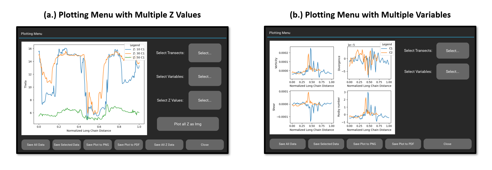
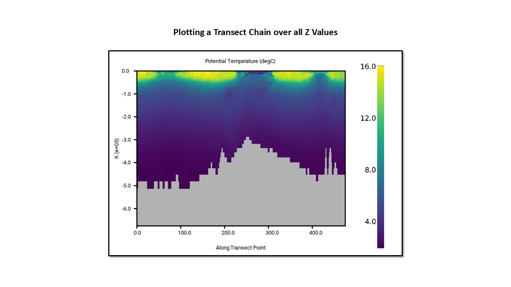

# Statement of Need

NcCut is a simple yet flexible NetCDF4 file and image viewer that is designed to require no programming or GIS 
experience to use.  In addition to being a GUI for generating "quick" visualizations of NetCDF4 data, NcCut allows a 
user to view and produce plots of transects of NetCDF4 data along various dimensions.  This is a 
commonly performed task in oceanography and atmospheric sciences research used to understand the vertical composition of 
a section of ocean or atmosphere. For example, @Sivkov:2021 used such vertical transects to study the vertical 
distributions of suspended particulate matter across the Atlantic ocean. In another example, @Gutjahr:2022 used vertical 
transects of modeled climate and ocean data in Greenland to study air-sea interactions during a Katabatic storm.

Such transect selecting tools are a common feature in GIS software (@qgis, @transectizer, @GRASS_GIS) and are present in 
some more complex viewers that work with unstructured data [@odv], but these options are all either meant for more 
complicated data formats or require a user to spend a great amount of time learning how to use the software before they 
can do any meaningful data analysis. NcCut provides this transecting functionality with a GUI interface, allowing for 
rapid selection of transects, which is often very useful in initial investigation or feature selection applications. 
There are many simple NetCDF viewers that already serve this audience (@Ncview, @Panoply, @ncvue), but none of these 
simpler viewers have a way for users to take transects across NetCDF data.

# Functionality

NcCut’s functions can be divided into two main categories:

## Viewer

NcCut allows users to load NetCDF4 files, or images in .JPG, .JPEG, or .PNG formats, and has adjustable graphics for 
different file sizes. In the case of NetCDF4 files, the user can choose between different variables and dimensions of 
the data to view. The user can select which dimensions to use as the x, y and z dimensions for the viewer, and once 
displayed the user can switch between different displays of the x, y dimensions at different z values. This is intuitive 
for many NetCDF4 files which contain three-dimensional datasets with data arrays at different vertical heights or 
depths. The data is displayed as an image mapped to a color map, which can be changed by the user as well as the 
contrast of the image. Once loaded and configured users can drag, rotate, flip, and zoom in on the file however they 
please. The NetCDF4 viewing capabilities and settings are shown in Figure 1, where an ocean temperature dataset from the MIT General Circulation 
Model LLC4320 simulation is being displayed (accessed via \verb|xmitgcm| https://xmitgcm.readthedocs.io/en/latest/index.html).

## "Cut" Making

Using NcCut, users can mark out transects onto loaded images or NetCDF4 data which can then be plotted and saved for further analysis. There two tools for marking out transects:

The first is the 'Inline Chain' tool. Users can click on points along a features and lines will be drawn connecting the points forming a "chain". Transects are then made along the line segments shown (Figure 2a). Multiple chains can be drawn at once, and plotted together in the plotting menu (Figure 3). When plotted, the transect data from each segment is plotted continuously end to end. If the loaded file is an image, the transect data is the mean of the RGB values of each pixel along the transect. The pixels are 
interpolated using linear interpolation to improve the accuracy of the pixel selection. If the loaded file is a NetCDF4 
file, the transect data is taken from the original dataset (also interpolated) at each point along the transect. 
The second is the 'Orthogonal Chain' tool. Using this tool users can click points along a feature and transects of a set width will be made orthogonal to the line 
marked out by the user (Figure 2b). This width can be adjusted at any point in the marking process and multiple such chains 
can be drawn on the same file and plotted together. For use on large projects worked on over multiple sessions, the 
transect data saved from the plotting menu (Figure 3) can be reloaded back into NcCut and continued.

In the plotting menu users can select which chains/transects to plot, and if the file is a NetCDF file the 
user can additionally plot multiple variables (Figure 3b) and values along the chosen z dimension (Figure 3a). Additionally, users can plot an interactive
vertical cross-section of the data values along the chain/transect for all z values (Figure 4). The y axis of the image is taken from and scaled by the coordinate values of the chosen z dimension. From this menu
users can choose to save the data to a .JSON file as well as save the plot to either a .PNG or .PDF format. The JSON 
file groups the transect data and their corresponding coordinates together and labels them by the transect number shown in the viewing interface. The transects are then further grouped by the chain they belong to. This labeled and 
organized data structure aims to be easily loaded and understood using minimal programming experience in a language such
as Python or R (there is a tutorial available [here](https://nccut.readthedocs.io/en/latest/example.html) on how to work with the output data using Python).

# References